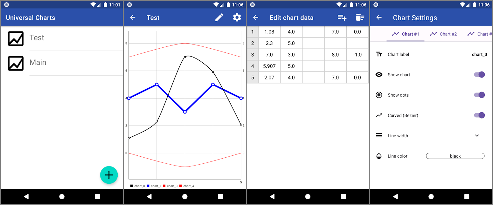

# Universal Charts

In this project I implement what's new I learn in Android. Core module is external library [MPAndroidChart](https://github.com/PhilJay/MPAndroidChart).
Around it is built this app. So, what interesting I've added here:

- Initially, all data was stored in local storage in csv files.
- After that, I started reworking the app to AAC principles.
- I then added saving all the data to a SQLite database using [Room](https://developer.android.com/training/data-storage/room).
- Then it was interesting to try to build a UI using [Jetpack Compose](https://developer.android.com/jetpack/compose/documentation) and I used it to create a chart settings window.
- And after all, I implemented the [Hilt](https://developer.android.com/training/dependency-injection/hilt-android) library to replace manual DIs with automatic ones.

## Screenshots

